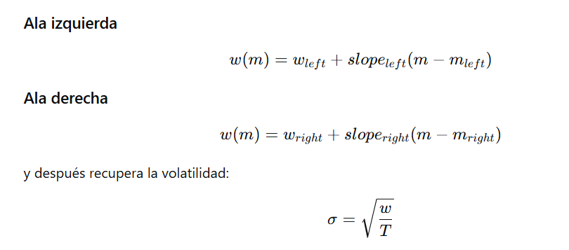

EL proceso de calculo parte del fichero de opciones (en bruto).

Referencias que justifican no usar IVS:
"
1. Beason & Schreindorfer (2022) — Review of Derivatives Research
"Option-implied information: What's the vol surface got to do with it?"
El mensaje central es que el método de construcción de la superficie de volatilidad importa mucho más de lo que la literatura asume. Usando opciones SPX 2004-2017 comparan la superficie de OptionMetrics (kernel 3D), la de Figlewski (spline semipamétrico), y proponen una nueva (kernel 1D).
Los hallazgos concretos son demoledores para IVS: la varianza risk-neutral de BKM difiere más de un 10% en promedio entre métodos, el variance risk premium difiere en un 60% de media, y las diferencias son aún mayores para la skewness risk-neutral — del orden del 200% o más. Springer
El problema se concentra en opciones OTM put — exactamente la región más importante para skewness y griegas de Bates.

2. Wallmeier (2024) — Journal of Futures Markets
"Quality Issues of Implied Volatilities in OptionMetrics IvyDB"
Identifica problemas concretos en los datos de OptionMetrics. Desde 2009 OptionMetrics registra precios de opciones sobre acciones en EEUU a las 3:59 p.m. en lugar de las 4:00 p.m. — el minuto de discrepancia con los precios de cierre del subyacente crea variabilidad artificial en los spreads de volatilidad implícita, con distorsiones especialmente grandes al inicio de la pandemia COVID-19. Para opciones sobre el S&P 500, el efecto combinado de precios no sincrónicos y el dividend yield implícito promedio genera desviaciones artificiales de la paridad put-call. SSRN"

## Fase 1:

### load forward_price:

En este script generamos un forward price filtrado para la security que nos interesa y tratamos fechas.
Nos quedamos con el AM cuando existe, porque es el contrato mensual estándar con mayor liquidez. El PM solo lo usas cuando no hay AM para ese vencimiento

### load opt_price:

*Sección 1*

El objetivo de este script es cargar y generar un fichero de opciones limpio:

Seleccionamos las fechas de interés:
    Tenemos fechas desde 1996.01 y 2024.02
    (inicialmente incluyo desde el 2003)

-Seleccionamos directamente el scurityID: 108105 (SP500, mantenemos SPX y SPXW)
-Formateamos el tipo fecha expiry y date.
-Creamos la variable de time to expiry en días (en uso, anualizar con base 365) teniendo en cuenta AMsettle.
-Calulamos Mid Price y filtramos NID > 0 , por mid price > 0, volumen > 0 y open interest > 0, implied volatility > 0.

-Aplicamos filtros para valores extremos del bid-ask (no implementado)

*Sección 2*

Importamos la el forward price para las fechas de interés.

-Asignamos para cada una de las fechas el forward price al vencimiento e interpolamos el forward price (convexisty error asumible)

-Podemos calcular el moneyness.

-Aplicamos filtros de moneyness para quitar extremos (0.8>x<1.2) (cambiar según proceda)
y en volumen(de momento no implementado).

*Sección 3*

Aplicamos los filtros de arbitrage, option bounds:

Para  Call y Puts:

Aplicamos lower bound y upper bound (demomento filtrado solo)

(dejo comentado otros filtros relacionados con la monotonicidad y convexidad)

Finalmente, quitamos los los strikes duplicados. Priorizamos los que tienen AM=0 y completamos con AM=1.

Por último, a fin de tener un resumen de la usabilidad relacionada con número de observaciones, spread, strike y venimiento, generamos un pequeño reporte ilustrativo (umbrales provisionales)

En esta primera fase quedan pendientes decisiones sobre:
1-> filtros sobre el spread
2-> filtros sobre atm/itm/otm
3-> filtros de volumen (más allá de que sea 0)
4.1-> filtros de moneyness
4.2-> filtros de strike
5-> Filtros de vencimiento (vemos en el summary que para vencimientos muy largos y muy cortos, tenemos más probelemas)

## Fase 2:

-Importamos los datos de opciones cotizados limpiados.

-Para construir la superficie en continuo, me quedo con las opciones OTM (call-put)

*Función de interpolación de volatilidad*
Cómo es estandar, se usa el método de interpolación cubic-spline. en este caso uso el Piecewise Cubic Hermite Interpolating Polynomial:
-1: ordeno por moneyness (no la log para tener los strikes separados uniformemente),
-2: Reviso duplicados,
-3: aplicamos la función de interpolación de scipy,
Y temporalemente las funciones para extrapolar las wings. 

